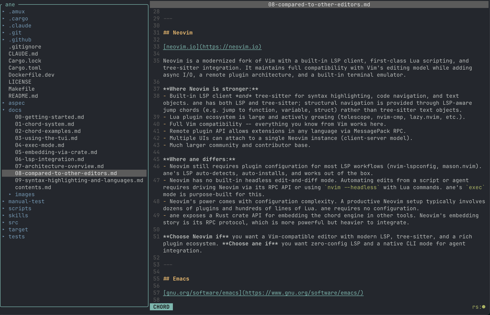

<p align="center">
	<strong>Chord based terminal code editor for humans and agents.</strong> 
	</br>
	Language server enabled for one-shot CLI or interactive TUI edits.
	</br>
	</br>
	
</p>

<p align="center">
	
</p>

---

## Installation

```sh
curl -s https://prettysmart.dev/install/ane.sh | sh
```

The installer detects your platform and puts `ane` on your `PATH`.

<details>
<summary>Other installation options</summary>

**With cargo:**

```sh
cargo install ane
```

**With mise** — using the [GitHub backend](https://mise.jdx.dev/dev-tools/backends/github.html):

```sh
mise use -g github:prettysmartdev/ane
```

To pin to a specific version: `mise use -g github:prettysmartdev/ane@0.1.0`

**From GitHub Releases** — download the binary for your platform from [GitHub Releases](https://github.com/prettysmartdev/ane/releases):

| Platform | Asset |
|----------|-------|
| Linux (x86_64) | `ane-linux-amd64` |
| Linux (ARM64) | `ane-linux-arm64` |
| macOS (Intel) | `ane-macos-amd64` |
| macOS (Apple Silicon) | `ane-macos-arm64` |

**From source** — requires Rust 1.75+ and make:

```sh
git clone https://github.com/prettysmartdev/ane.git
cd ane
sudo make install
```

</details>

---

# ane

**A New Editor** / **Agent Native Editor**

`ane` is a new take on chord-based code editing in the terminal. By combining 1) **one-shot code editing** for scripts and code agents via `ane exec`, 2) **language server and tree-sitter** support by default, and 3) a **language-server-aware chord system**, `ane` aims to help with focused, efficient edits to source code for humans and code agents alike.

**Note:** `ane` is still early and everything including supported chords, languages, and TUI/CLI features are still a work in progress. There will be vim chords that don't have an equivalent (yet). If you have a desired chord component, language, or feature you'd like to see added to `ane`, issues and PRs are always welcome. `ane` is my daily driver editor already, and I will be working to improve it rapidly.

### Goals

1. **Chord-native editing** -- a 4-part chord system (action, positional, scope, component) for expressive, composable editing operations
2. **Agent-native interface** -- a headless `exec` mode that lets AI code agents read and modify files with minimal token usage, outputting standard unified diffs
3. **LSP-integrated** -- native language server integration for language-aware chords (Rust, Go, TypeScript/JavaScript, Python)

### Non-goals
1. Be a perfect drop-in replacement for {favorite editor}. ane's similar-but-different chord system, lack of plugin system, and small-but-reasonable core featureset means it won't replace VSCode or your highly curated vim setup. It's an experiment on merging chords and language servers to see if humans and agents can develop code more efficiently.
2. Be the absolute fastest or most memory efficient editor ever made. Adding a language server by default will always make `ane` slower than vim or emacs, and that's OK. It's a middle ground between "classic" terminal editors and full-on desktop editors like Zed, VSCode, and JetBrains products.
3. Be extremely extensible (yet). The focus for `ane` is to nail the core featureset (robust chord engine, reliable language server integration, be extremely usable by code agents via CLI or crate). Adding plugins would be great one day, but until the core featureset is at 1.0-level quality, plugins will not be a priority.

---

# Chord System

`ane` lets you edit source code very precisely using key chords via its chord engine. `ane` chords have 4 parts: **action**, **positional**, **scope**, **component**.

| Part | Codes | Description |
|------|-------|-------------|
| Action | `c`hange, `d`elete, `r`eplace, `y`ank, `a`ppend, `p`repend, `i`nsert, `j`ump | What to do |
| Positional | `i`nside, `e`ntire, `a`fter, `b`efore, `u`ntil, `t`o, `o`utside, `n`ext, `p`revious | Where relative to scope |
| Scope | `l`ine, `b`uffer, `f`unction, `v`ariable, `s`truct, `m`ember, `d`elimiter | What language construct |
| Component | `b`eginning, `c`ontents, `e`nd, `v`alue, `p`arameters, `a`rguments, `n`ame, `s`elf | Which part of the scope |

**Examples:**
- `cifc` -- **C**hange **I**nside **F**unction **C**ontents (short form)
- `ChangeInsideFunctionContents` -- same chord, long form
- `cels(target:5, value:"new text")` -- change line 5 to "new text"
- `jnfn` -- **J**ump **N**ext **F**unction **N**ame (move cursor to the next function)

Chords that target language constructs (Function, Variable, Struct, Member) require an active LSP connection. Line, Buffer, and Delimiter scopes work without LSP.

See the [Chord System reference](docs/01-chord-system.md) for the full grammar and [Chord Examples](docs/02-chord-examples.md) for worked before/after examples of every valid scope/component combination.

### Frontend-Aware Execution

Chords behave differently depending on the frontend:

- **CLI (`ane exec`)**: accepts all arguments as parameters, returns a unified diff
- **TUI**: manipulates editor state (cursor, mode) for interactive editing

This also means that not all chords are valid for both frontends, like `j` to jump the cursor - the CLI has no cursor and therefore rejects `jump` chords.

# Usage

## TUI Mode (interactive editing)

```bash
# Open current directory (file tree + editor)
ane .

# Open a specific file
ane path/to/file.rs
```



**Keybindings:**

| Key | Action |
|-----|--------|
| `Ctrl-E` | Toggle between Edit mode and Chord mode |
| `Ctrl-T` | Toggle file tree pane (creates tree if opened with single file) |
| `Ctrl-S` | Save file (works in any mode) |
| `Ctrl-R` | Recall previous chord (Chord mode). Press repeatedly to cycle backwards through chord history. Press Enter to execute the recalled chord |
| `Ctrl-C` | Exit `ane` (opens modal to confirm exit and/or save edited file if needed)
| `Arrow keys` | Navigate (Edit/Chord: move cursor; Chord with input: left/right move chord cursor) |
| `Enter` | Open file from tree / execute chord / newline (context-dependent) |
| `Esc` | Return to Chord mode (Edit mode) / clear chord input (Chord mode) |

**Modes:**
- **Chord mode** (default): type a chord in the command box and press Enter to execute. Short-form chords are executed without 'Enter' if they are valid for the current cursor's position (i.e. `cifc` will automatically execute if the cursor is resting within a recognized function).
- **Edit mode**: direct text editing of the open buffer. Toggle with `Ctrl-E` or press 'Esc' to exit edit mode.

See [Using the TUI](docs/03-using-the-tui.md) for the full guide.

## Exec Mode (for code agents)

```bash
# Short form
ane exec --chord "cifc(target:foo, value:\"return 0;\")" path/to/file.rs

# Long form
ane exec --chord "ChangeInsideFunctionContents(target:foo, value:\"return 0;\")" path/to/file.rs

# Line operations (no LSP needed)
ane exec --chord "cels(target:5, value:\"new text\")" path/to/file.rs
ane exec --chord "dels(target:3)" path/to/file.rs

# Yank (read) entire file
ane exec --chord "yebs" path/to/file.rs

# Pipe value from stdin
echo "new body" | ane exec --chord "cifc(target:foo, value:-)" path/to/file.rs
```

Exec mode outputs a unified diff to stdout showing what changed. Yank chords output the selected text.

See [Exec Mode](docs/04-exec-mode.md) for the full guide.

## Embedded via Crate

ane's chord engine, LSP engine, and buffer management are available as a Rust library. Disable the default `frontends` feature to drop CLI/TUI dependencies:

```toml
[dependencies]
ane = { version = "0.1", default-features = false }
```

```rust
use ane::core::{parse_chord, execute_chord, tool_definition};

let query = parse_chord("cifn(target:old, value:\"new\")")?;
// ... execute against a buffer with the chord engine
```

`ane::core::tool_definition()` returns a ready-to-serialize tool definition for LLM tool-use APIs (Claude, OpenAI, etc.).

See [Embedding via Crate](docs/05-embedding-via-crate.md) for the full API reference.

## LSP Integration

ane natively integrates with language servers for language-aware chord operations.

- **Auto-detection**: detects the project language (e.g., `Cargo.toml` -> Rust) and starts the appropriate language server
- **Async startup**: LSP starts in the background; non-LSP chords (Line, Buffer, Delimiter) work immediately
- **Status display**: the TUI status bar shows LSP status (ready, starting, not installed, failed)
- **Chord gating**: chords marked `requires_lsp: true` wait for LSP readiness; non-LSP chords execute immediately
- **Install assistance**: if the language server isn't installed, ane automatically installs if possible
- **Syntax highlighting**: tree-sitter provides immediate structural highlighting on open; LSP semantic tokens add type-aware colors once the server is ready

Supported languages:

| Language | LSP server | Detection |
|----------|------------|-----------|
| Rust | rust-analyzer | `Cargo.toml` |
| Go | gopls | `go.mod`, `go.work` |
| TypeScript / JavaScript | vtsls | `package.json`, `tsconfig.json` |
| Python | basedpyright | `pyproject.toml`, `pyrightconfig.json`, `setup.py` |
| Markdown | — | `.md`, `.markdown` |

All languages include tree-sitter syntax highlighting. See [Syntax Highlighting and Languages](docs/09-syntax-highlighting-and-languages.md) for details.

See [LSP Integration](docs/06-lsp-integration.md) for details.

## Architecture

ane uses a strict 3-layer architecture with unidirectional dependencies:

```
Layer 2: Frontend (CLI + TUI + frontend traits)
    | calls down to
Layer 1: Commands (chord engine + diff + LSP engine)
    | calls down to
Layer 0: Data (buffers, file tree, state, chord types, LSP registry)
```

- **Layer 0 (data)** -- all filesystem I/O, state, chord type definitions, LSP server registry/schemas/types
- **Layer 1 (commands)** -- chord parsing/resolution/patching, diff generation, LSP client lifecycle and requests, LSP installation
- **Layer 2 (frontend)** -- CLI argument parsing, TUI rendering/event handling, frontend action traits

Lower layers never import from higher layers. Violating this is an architectural error.

See [Architecture Overview](docs/07-architecture-overview.md) for the full design.

## Documentation

The full user guide is in [`docs/`](docs/contents.md):

| # | Guide | What's covered |
|---|-------|----------------|
| 00 | [Getting Started](docs/00-getting-started.md) | Installation, concepts, first edits |
| 01 | [Chord System](docs/01-chord-system.md) | Full 4-part grammar reference |
| 02 | [Chord Examples](docs/02-chord-examples.md) | Before/after examples for every combination |
| 03 | [Using the TUI](docs/03-using-the-tui.md) | Modes, keybindings, file tree |
| 04 | [Exec Mode](docs/04-exec-mode.md) | One-shot CLI edits, agent patterns |
| 05 | [Embedding via Crate](docs/05-embedding-via-crate.md) | Rust library API, feature flags |
| 06 | [LSP Integration](docs/06-lsp-integration.md) | Language server setup and status |
| 07 | [Architecture Overview](docs/07-architecture-overview.md) | Three-layer design |
| 08 | [Compared to Other Editors](docs/08-compared-to-other-editors.md) | Trade-offs vs Vim, Emacs, Helix, etc. |

## Building

```bash
cargo build              # dev build
cargo build --release    # release build (LTO + strip)
cargo test               # all tests
cargo clippy -- -D warnings
cargo fmt --check
```

### Using the dev container

```bash
docker build -f Dockerfile.dev -t ane-dev .
docker run -it -v $(pwd):/workspace ane-dev
```
