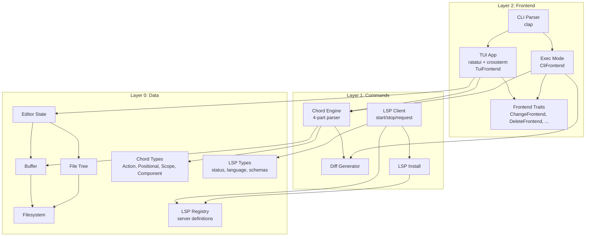

# Project Architecture

Pattern: monolith

## Design Principles

### Principle 1: Strict Layered Architecture
Description:
- The codebase is organized into three layers with strict dependency rules
- Layer 0 (data): All filesystem I/O, internal state management, chord type definitions, LSP server registry/schemas/install paths
- Layer 1 (commands): Chord logic, diff generation, LSP client operations (start/stop/status/requests), LSP installation — calls down into Layer 0
- Layer 2 (frontend): CLI parsing, TUI rendering, frontend action traits — calls down into Layers 0 and 1
Reasoning:
- Prevents circular dependencies and keeps the codebase testable
- Layer 0 and 1 can be tested without any terminal or UI dependencies
- The exec (agent) mode and TUI mode share the same data and command layers

### Principle 2: Dual-Mode Operation with Frontend Traits
Description:
- The same binary serves both interactive (TUI) and programmatic (exec) use cases
- TUI mode: full ratatui terminal editor with file tree, editor panes, command bar, and status bar
- Exec mode: headless chord execution that outputs unified diffs
- Each action type (Change, Delete, Insert, etc.) has a frontend trait that CLI and TUI implement differently
- Example: `ChangeFrontend` in CLI accepts replacement text as a parameter; in TUI it clears the target, positions the cursor, and enters Edit mode
Reasoning:
- Code agents need a fast, token-efficient interface that doesn't require a terminal
- Human developers need a rich interactive experience
- Frontend traits allow the same chord to behave appropriately for each context

### Principle 3: 4-Part Chord System
Description:
- Every chord has 4 parts: Action (what), Positional (where relative), Scope (what construct), Component (which part)
- Short form: `cifb` = Change In Function Body
- Long form: `ChangeInFunctionBody`
- Each chord declares whether it requires LSP
Reasoning:
- Composable — the matrix of combinations scales across actions, scopes, and components
- Terse — short form minimizes tokens for AI agents
- Readable — long form is self-documenting for humans
- Extensible — new actions, scopes, and components can be added without restructuring

### Principle 4: Native LSP Integration
Description:
- ane integrates with language servers for language-aware chord operations
- LSP server definitions, schemas, install paths, and URLs live in Layer 0 (data)
- LSP client operations (starting, stopping, checking status, making requests) live in Layer 1 (commands)
- Language detection is automatic (e.g., Cargo.toml → Rust → rust-analyzer)
- LSP starts async in the background at launch
- Chords marked `requires_lsp: true` wait for LSP readiness; others execute immediately
- Currently supports Rust (rust-analyzer); more languages will follow
Reasoning:
- Language-aware chords (e.g., "change function body") need semantic understanding that only an LSP provides
- Background startup means non-LSP chords are never delayed
- Per-chord LSP gating means graceful degradation when LSP is unavailable

## High-level Architecture:

## Major Components

### Component 1:
Name: Data Layer (Layer 0)
Purpose: Manage all filesystem interactions, in-memory state, chord type definitions, and LSP data
Description and Scope:
- Buffer: reads files into line-based in-memory representation, tracks dirty state, writes back
- FileTree: walks a directory recursively, produces a sorted list of entries for display
- EditorState: holds open buffers, cursor position, mode (Edit/Chord), chord input, LSP status, exit modal state
- ChordTypes: Action, Positional, Scope, Component enums with short/long form parsing, ChordSpec struct
- LSP Types: LspStatus, Language enum, SymbolLocation, LspServerInfo, LspInitParams
- LSP Registry: Server definitions per language, language detection from file extensions and project markers

### Component 2:
Name: Command Layer (Layer 1)
Purpose: Execute chords, generate diffs, and manage LSP lifecycle
Description and Scope:
- ChordEngine (`chord_engine/`): 3-stage pipeline (Parser → Resolver → Patcher) that transforms a chord string + named buffers into `ChordAction` objects. See `aspec/architecture/chord-engine.md`.
- Diff: generates unified diffs from before/after content using the `similar` crate
- LSPEngine (`lsp_engine/`): state-machine-driven lifecycle manager for all language servers. Handles detection, installation, startup, health monitoring, request dispatch, and shutdown. See `aspec/architecture/lsp-engine.md`.

### Component 3:
Name: Frontend Layer (Layer 2)
Purpose: Handle all user-facing input/output and define frontend-specific chord behavior
Description and Scope:
- CLI: parses command-line arguments with clap (TUI path vs exec subcommand)
- Frontend Traits: ChangeFrontend, DeleteFrontend, InsertFrontend, ReadFrontend, MoveFrontend, SelectFrontend, YankFrontend — each action has a trait, and ChordFrontend provides dispatch
- CliFrontend: CLI implementations — chords take args as parameters, output diffs
- TuiFrontend: TUI implementations — chords manipulate cursor/mode (e.g., Change clears content, enters Edit mode)
- TUI App: main event loop, keybinding handlers for Chord mode and Edit mode
- Command Bar: chord input text box shown in Chord mode
- Status Bar: mode indicator, file info, cursor position, LSP status
- Exit Modal: Ctrl-C confirmation dialog
- Editor Pane: renders the active buffer with line numbers and cursor
- Tree Pane: renders the file tree with selection highlighting
